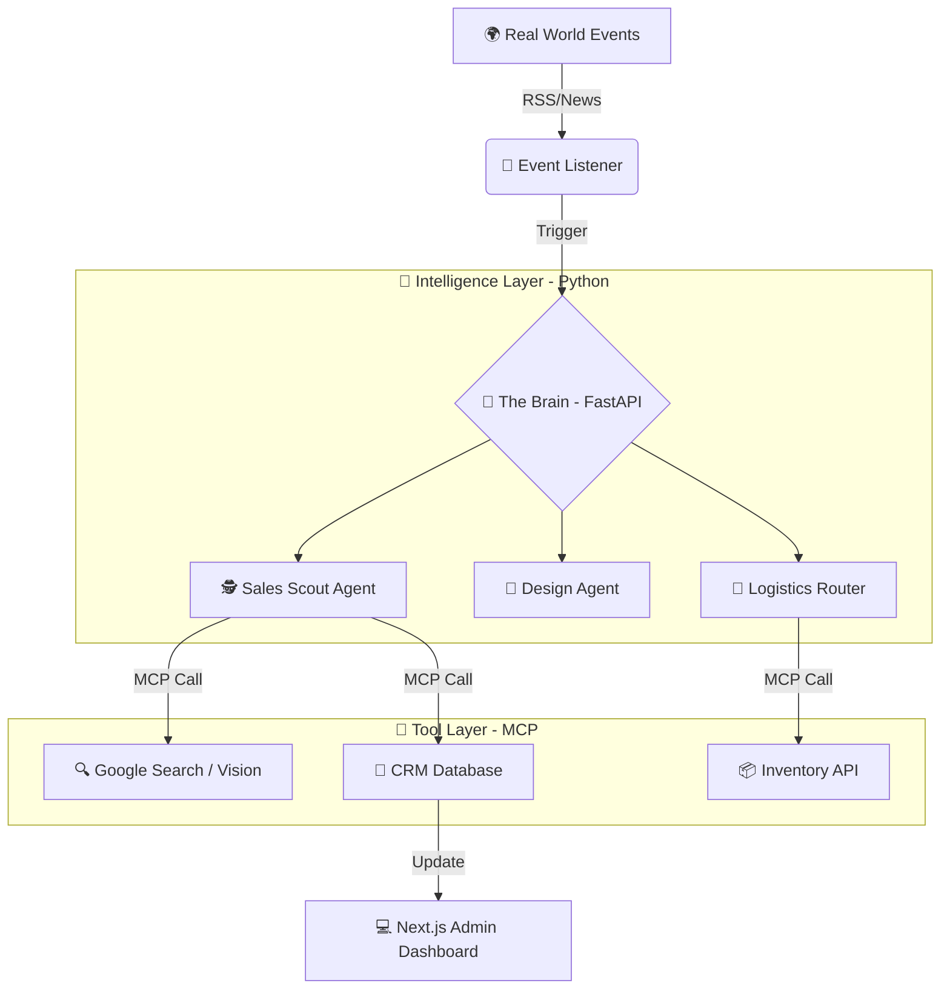

# 👕 Fresh Prints OS

### The Autonomous Business Engine

[](https://python.org)
[](https://fastapi.tiangolo.com)
[](https://langchain-ai.github.io/langgraph/)
[](https://modelcontextprotocol.io)

> **🧠 The "Brain" for Custom Apparel Logistics**  
> *A Cognitive Architecture that transforms Fresh Prints from a "Store" into an "Autonomous Business"*

---

## 🏗️ The Architecture

**"Python Brain, Node.js Body"**

This project solves the core engineering challenge of integrating advanced AI Agents into an existing Node.js ecosystem.

Instead of rewriting the legacy backend, **Fresh Prints OS** acts as a detached **Intelligence Microservice**. It uses the **Model Context Protocol (MCP)** to "drive" existing tools (Inventory, CRM, Email) via a high-performance Python reasoning layer.

### System Design



---

## 🤖 The Agents

We move beyond simple chatbots. These are **Goal-Oriented Agents** running on LangGraph with sophisticated reasoning capabilities.

### 🕵️ Sales Scout — Lead Generation & Strategy

**Trigger:** University RSS Feeds  
**Output:** Personalized Outreach

**Reasoning Flow:**
1. 📡 Detects "Sellable Events" (e.g., "Robotics Team wins Championship")
2. 🔍 Analyzes club's visual identity using DuckDuckGo & Vision
3. 💡 Formulates pitch strategy (e.g., "Pitch a 'Champions' rebrand with gold foil")
4. ✉️ Drafts hyper-personalized email → Saves to CRM

---

### 🎨 Design Validator — Compliance & Cost Control

**Trigger:** Design Request  
**Output:** Validated Artwork

**Reasoning Flow:**
1. 👁️ Vision RAG checks generated art against University Brand Guidelines
2. 🏛️ Ensures brand compliance (e.g., "No red on Ohio State logos")
3. 💰 Calculates ink colors vs. budget
4. ✨ Auto-simplifies design if too expensive

---

### 🚚 Logistics Router — Margin Defender

**Trigger:** Order Placement  
**Output:** Optimal Routing

**Reasoning Flow:**
1. 📍 Checks stock across multiple warehouses (NJ, TX, CA)
2. 📊 Calculates real-time shipping costs
3. ⏱️ Factors in production latency
4. 🎯 Routes to the most profitable factory that meets the deadline

---

## 🛠️ Technology Stack

| Category | Technology | Purpose |
|----------|------------|---------|
| **Orchestration** | LangGraph | Stateful Multi-Agent Loops |
| **API Framework** | FastAPI | Async/Await High Performance |
| **Integration** | Model Context Protocol (MCP) | Tool Orchestration |
| **Intelligence** | OpenAI GPT-4o | Reasoning Engine |
| **Database** | SQLite + ChromaDB | CRM/Logs + Vector Search |
| **Real-Time** | Feedparser + DuckDuckGo | RSS & Live Web Search |

---

## 🚀 Getting Started

### Prerequisites

- 🐍 Python 3.10+
- 🔑 OpenAI API Key
- 💻 Git

### Installation

**1. Clone the Repository**

```bash
git clone https://github.com/shasank123/Fresh-Prints-OS.git
cd Fresh-Prints-OS
```

**2. Setup Backend Environment**

```bash
cd backend
python -m venv venv

# Windows
venv\Scripts\activate

# macOS/Linux
source venv/bin/activate

pip install -r requirements.txt
```

**3. Configure Environment**

Create a `.env` file in `/backend`:

```env
OPENAI_API_KEY=sk-your-key-here
LANGCHAIN_TRACING_V2=true  # Optional: For LangSmith debugging
```

**4. Initialize Database**

```bash
python database.py
```

### Running the System

Open **two terminal windows**:

```bash
# Terminal 1: 🧠 The Brain (API Server)
python main.py
# ✅ API live at http://localhost:8000
```

```bash
# Terminal 2: 👂 The Ear (Event Listener)
python listener.py
# ✅ Listening to MIT/Michigan News Feeds...
```

---

## 📂 Project Structure

```
fresh-prints-os/
├── backend/
│   ├── agents/              # LangGraph Reasoning Logic
│   │   └── scout_agent.py   # The "ReAct" Sales Scout
│   ├── tools/               # MCP Tool Definitions
│   │   ├── search_tools.py  # Real Web Search & Vision
│   │   └── crm_tools.py     # Database Interactions
│   ├── main.py              # FastAPI Entry Point
│   ├── listener.py          # Real-time RSS Event Trigger
│   ├── mcp_server.py        # Model Context Protocol Server
│   └── database.py          # SQLite Setup
└── README.md
```

---

## 🔮 Roadmap

- [ ] 🖥️ **Frontend**: Next.js Admin Dashboard for Human-in-the-Loop (HITL) approval
- [ ] 🎨 **Vision**: Integration with Replicate/Flux for real-time design generation
- [ ] 🐳 **Production**: Dockerize the Python Microservice for AWS deployment
- [ ] 📊 **Analytics**: Real-time performance metrics & agent observability

---

## 🤝 Contributing

Contributions are welcome! Please feel free to submit a Pull Request.

---

**Built with ❤️ by [Shasank Polamraju](https://github.com/shasank123) for the Fresh Prints Engineering Team**